# NeonPing — System Architecture & Design

**Last updated**: 2026-06-17  
**Status**: Production-ready, live on Azure Container Apps  
**Audiences**: Developers, AI code assistants, future maintainers, Shopify auditors

---

## Table of Contents
1. [System Overview](#system-overview)
2. [High-Level Architecture](#high-level-architecture)
3. [Component Details](#component-details)
4. [Data Flow Diagrams](#data-flow-diagrams)
5. [Integration Points](#integration-points)
6. [Database Schema](#database-schema)
7. [Deployment Architecture](#deployment-architecture)
8. [Security Model](#security-model)

---

## System Overview

NeonPing is a **B2B SaaS AI chat widget** for Shopify storefronts. Merchants install it on their storefront as a theme app extension; customers interact with it via a minified JS widget. The backend uses multi-agent AI (gpt-4o-mini on Azure AI Foundry) to understand customer intent, search the merchant's live Shopify catalog (via Storefront MCP), manage carts, and handle abandoned-cart recovery.

**Key differentiator**: All catalog data is **always fresh** — we never sync/cache it. Every search hits Shopify's live Storefront MCP endpoint.

---

## High-Level Architecture

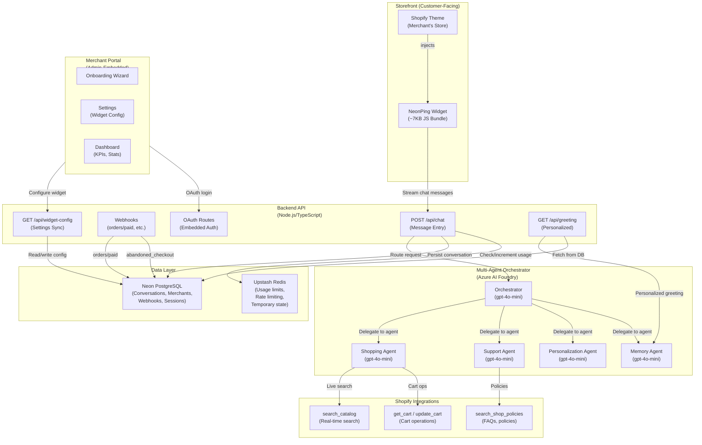

---

## Component Details

### 1. **Storefront Widget** (`extensions/chat-widget/assets/neonping-widget.js`)

**Purpose**: Customer-facing chat launcher + message interface  
**Bundle size**: 7.07 KB / 10 KB cap  
**Triggers**:
- Exit-intent (desktop, mouse leaves viewport)
- 30s time-on-page (mobile)
- Manual launcher click

**Architecture**:
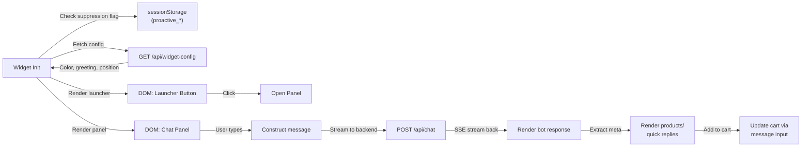

**Key features**:
- Live config fetching (color, position, greeting)
- Proactive engagement with suppression flag (prevents double-fire)
- Server-sent events (SSE) for streaming responses
- Product card rendering from bot `meta` response
- Quick-reply buttons

---

### 2. **Backend API Routes** (`app/routes/api.*.tsx`)

#### `api.chat.tsx` (Message Processing)
```
POST /api/chat
├─ Input: { session_id, shop, message, customer_id?, cart_total_cents? }
├─ Check rate limit (Redis, plan-based)
├─ Build context (customer, cart, merchant config)
├─ Call Orchestrator agent
├─ Persist conversation to Postgres
├─ Stream SSE response back to widget
└─ Output: SSE stream with { event, data } pairs
    ├─ event: "message" → bot text response
    ├─ event: "meta" → { products, discount_code, checkout_url, quick_replies }
    └─ event: "error" → error message
```

#### `api.widget-config.tsx` (Settings Sync)
```
GET /api/widget-config?shop=...
├─ Fetch merchant settings from Postgres
├─ Return { color, position, greeting }
└─ Widget uses this to apply saved customization
```

#### `api/greeting.tsx` (Personalized Opening)
```
GET /api/greeting?shop=...&customer_id=...
├─ Fetch customer memory (recent_products)
├─ Call Memory agent to personalize
└─ Return custom greeting mentioning recent products
```

---

### 3. **Merchant Portal** (Admin-Embedded App)

#### Onboarding (`app/routes/app.onboarding.tsx`)
4-step wizard:
1. Widget appearance (color, position, greeting)
2. AI behavior (brand voice, discount limits, VIP threshold)
3. Support configuration (support email)
4. Verify installation (deep link to theme editor, App Embeds section)

#### Settings (`app/routes/app.settings.tsx`)
- Edit widget appearance with **live preview**
- Edit AI behavior settings
- Settings saved to Postgres
- Widget fetches via `/api/widget-config`

#### Dashboard (`app/routes/app._index.tsx`)
- Total conversations count
- Conversion rate (carts created via chat / total conversations)
- AOV (average order value from chat-attributed orders)
- Cart recovery rate (abandoned carts recovered)

---

### 4. **Multi-Agent Orchestrator** (`app/lib/agents/orchestrator.server.ts`)

**Flow**:
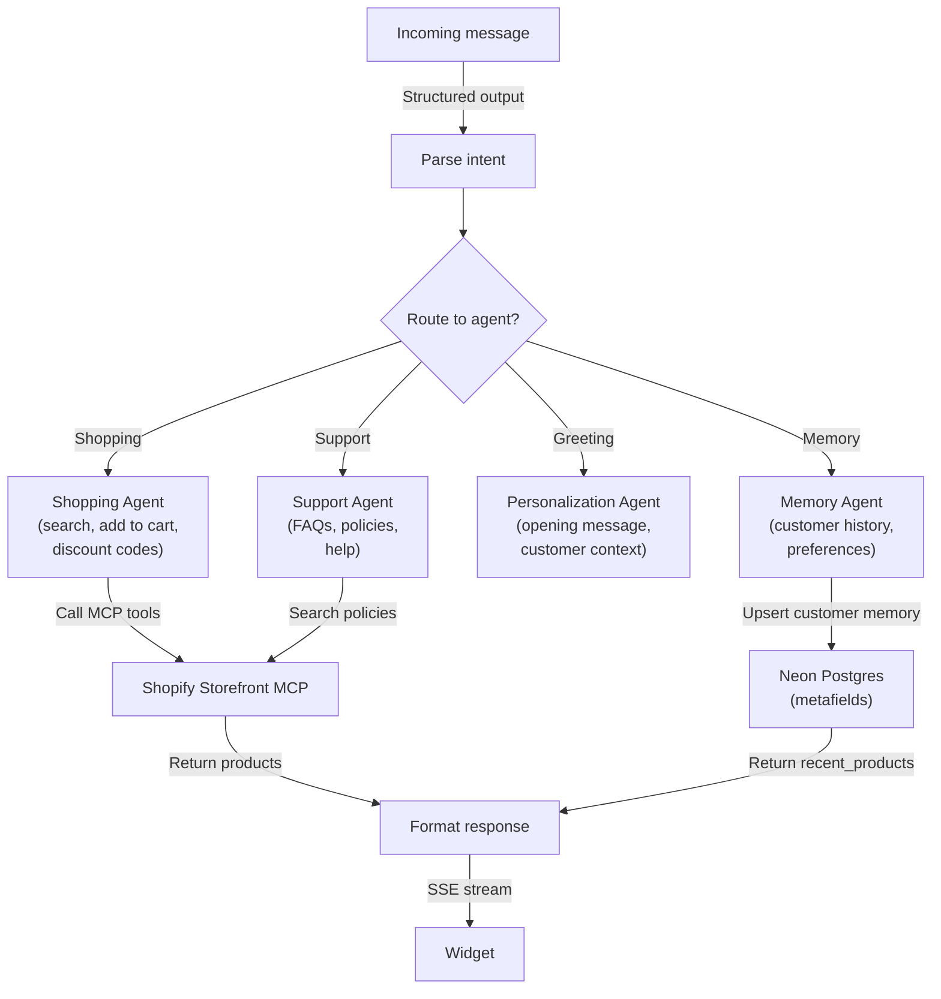

**Agent tools**:
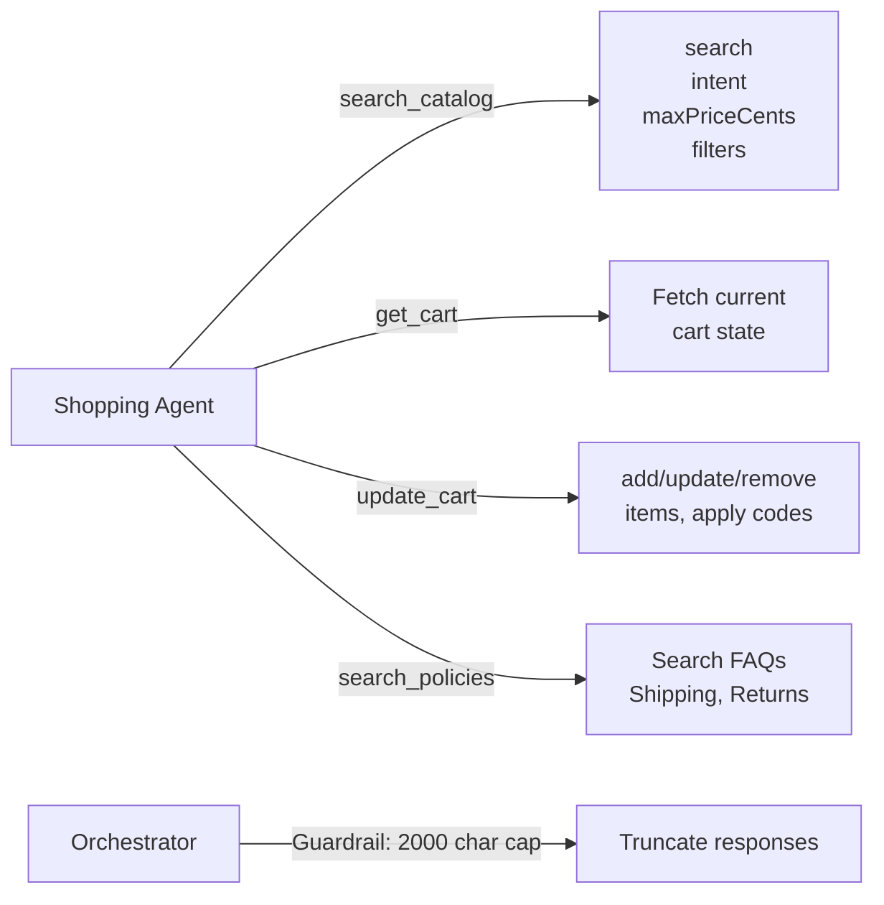

---

### 5. **Shopify Integrations** (`app/lib/mcp/`)

#### Storefront MCP (UCP - Universal Commerce Protocol)

**Why Storefront MCP, not Admin API?**
- ✅ Always-fresh data (no sync lag, no hallucination risk)
- ✅ Public endpoint, customer-facing, reflects real storefront
- ✅ Faster (real-time vs. admin API rate limits)
- ❌ Limited to read-only catalog + cart operations (can't list customers, create orders, etc.)

**Tools available**:
```
✅ search_catalog (with intent + maxPriceCents for ranking)
✅ get_cart
✅ update_cart (add/remove/update items, discount codes, gift card codes)
✅ search_shop_policies_and_faqs
✅ get_product_details

❌ list_products (use search_catalog instead)
❌ create_checkout (Shopify hosted checkout is confirmation gate)
❌ get_order (requires Dev Dashboard credentials)
❌ get_customer_orders (Storefront API, not available on this tier)
```

**Search context fields**:
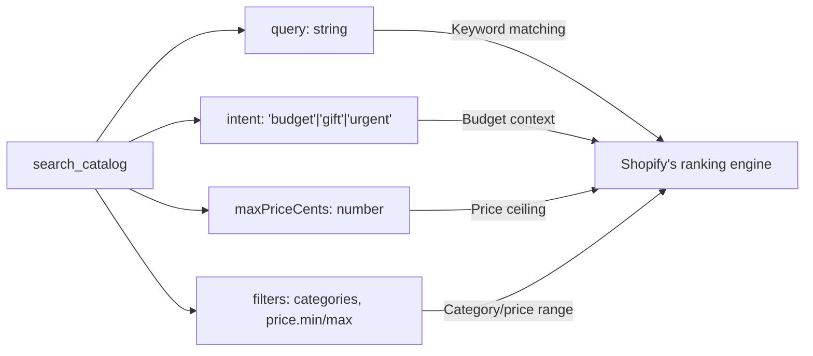

#### Webhooks (Real-Time Events)

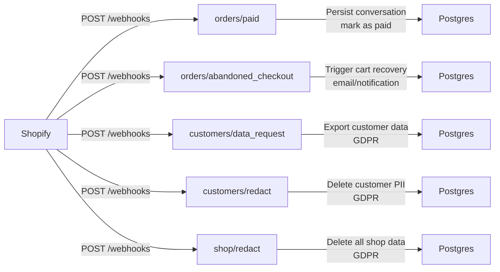

---

## Data Flow Diagrams

### Customer Message Flow (End-to-End)

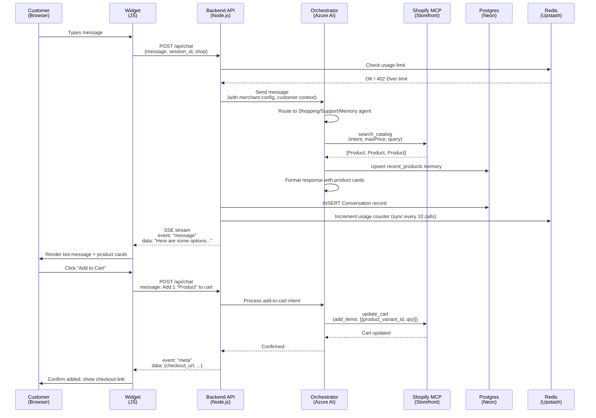

### Order Attribution & Revenue Tracking

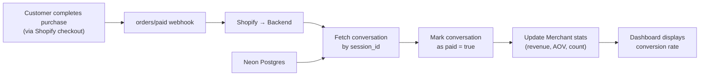

---

## Integration Points

### 1. **Shopify Partner Dashboard** (OAuth, Configuration)
- App registered with Client ID: `d1ed7250a107b38802ff74de11f699f3`
- Scopes: `write_products`, `read_customers`, `write_discounts`, `read_orders`
- Redirect URL: Azure Container App URL
- Webhooks: Configured via `shopify.app.toml` (compliance_topics for GDPR)

### 2. **Azure AI Foundry** (LLM Calls)
- Endpoint: `/openai/v1` (compatible with OpenAI SDK)
- Model: `gpt-4o-mini` (all agents use this)
- Auth: Environment variable `AZURE_OPENAI_API_KEY`
- Streaming: Supported via `vercel/ai` SDK's `generateObject` + streaming

### 3. **Neon PostgreSQL** (Persistent Data)
- URL: `DATABASE_URL` env var
- ORM: Prisma
- Tables: `Merchant`, `Conversation`, `CustomerMemory`, `WebhookLog`
- Backup: Automatic Neon backups

### 4. **Upstash Redis** (Caching & Rate Limiting)
- URL: `REDIS_URL` env var (rediss:// for TLS)
- Keys: `usage:{shop}:{month}`, `neonping_proactive_{shop}`, `neonping_sid_{shop}`
- Strategy: Source-of-truth for live limit checks; Postgres for durability

### 5. **Shopify Storefront MCP** (Live Catalog)
- Endpoint: `https://{shop}/api/mcp` (JSON-RPC 2.0)
- Auth: Customer access token (from storefront, public)
- No caching, always fresh

---

## Database Schema

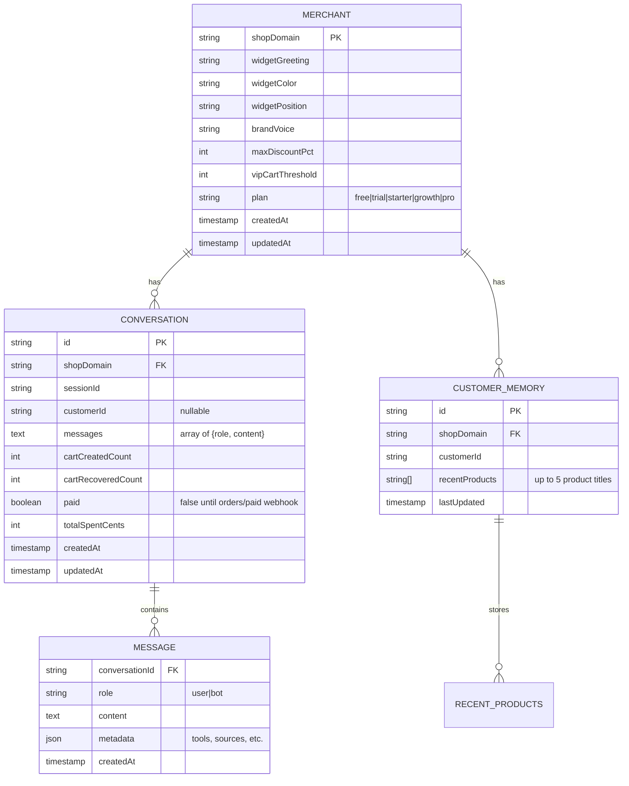

---

## Deployment Architecture

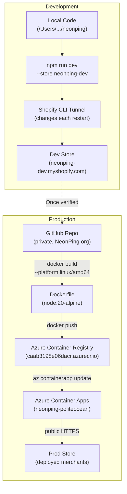

**Build process**:
```bash
docker build --platform linux/amd64 \
  -t caab3198e06dacr.azurecr.io/neonping:v4 .
docker push caab3198e06dacr.azurecr.io/neonping:v4
az containerapp update \
  --name neonping \
  --resource-group neonping-rg \
  --image caab3198e06dacr.azurecr.io/neonping:v4
```

**Environment variables** (set on Azure Container App):
```
DATABASE_URL=postgresql://...
REDIS_URL=rediss://...
SHOPIFY_API_KEY=...
SHOPIFY_API_SECRET=...
SHOPIFY_APP_URL=https://neonping.politeocean-a6f0ef16.southcentralus.azurecontainerapps.io
AZURE_OPENAI_API_KEY=...
AZURE_OPENAI_ENDPOINT=...
```

---

## Security Model

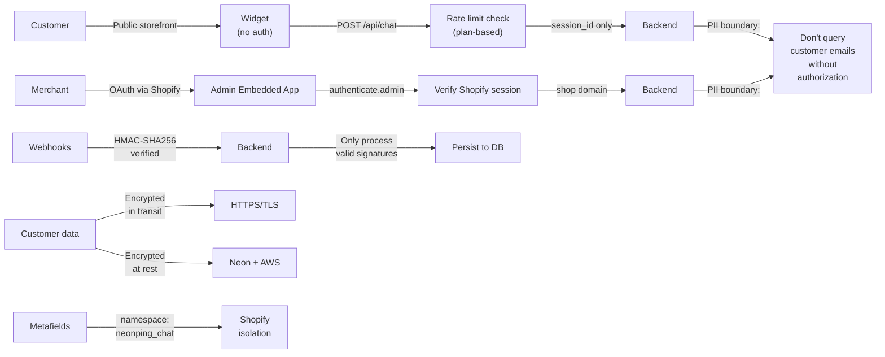

**Key principles**:
- ✅ No customer email harvesting without explicit authorization
- ✅ Webhook HMAC verification (Shopify-signed)
- ✅ GDPR webhooks: customers/data_request, customers/redact, shop/redact
- ✅ Session isolation (session_id is opaque UUID, not predictable)
- ✅ Rate limiting (Redis-based, plan-enforced)
- ✅ Message cap (2000 chars guardrail)
- ✅ Widget size cap (10 KB, verified on every change)

---

## Handoff Checklist for New Developers/AI Assistants

Before starting work, confirm you understand:

- [ ] **Widget is always live**; widget JS is minified and <10KB
- [ ] **No catalog caching**; every `search_catalog` hits Shopify's live MCP
- [ ] **Storefront MCP only**; no Admin API for catalog (intentional, for freshness)
- [ ] **Multi-agent orchestrator** routes messages to Shopping/Support/Personalization/Memory agents
- [ ] **Database tables**: Merchant, Conversation, CustomerMemory, WebhookLog (via Prisma)
- [ ] **Redis is source of truth** for usage limits; Postgres is durable backup
- [ ] **Webhooks are GDPR-mandated**; use `compliance_topics` in TOML, not `topics`
- [ ] **Rate limiting is plan-based** (free/trial/starter:500, growth:2000, pro:unlimited)
- [ ] **Embedded app runs on Azure**, not a dev tunnel; static URL for Shopify OAuth
- [ ] **Session isolation**: session_id is UUID, not customer_id; no customer email in widget
- [ ] **GitHub kanban is source of truth** for what's done/open/blocked

---

## References

- **CLAUDE.md**: Quick start, what's built, what's pending
- **SESSION_STARTER.md**: New session action items
- **Memory file**: `/Users/krkaushikkumar/.claude/projects/-Users-krkaushikkumar-Desktop-neonping/memory/project_neonping.md`
- **GitHub board**: https://github.com/orgs/NeonPing/projects/1
- **Shopify docs**: https://shopify.dev (Storefront MCP, Admin API, Webhooks)

---

Good luck! 🚀
