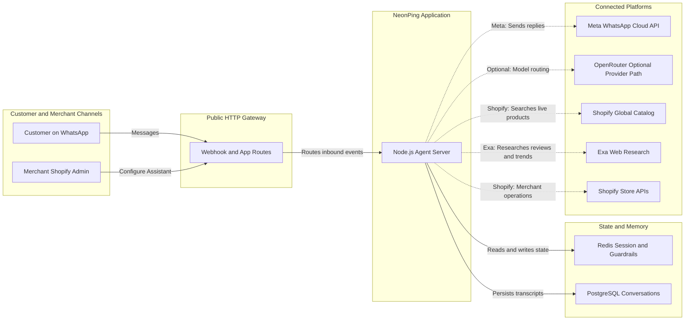

# NeonPing Global Concierge

### A WhatsApp-native shopping agent for discovering the right product across Shopify stores

NeonPing turns a natural shopping conversation into a confident purchase decision. A customer can say what they need in ordinary language, refine the request over multiple turns, ask for comparisons or recent reviews, and open the correct seller checkout without leaving WhatsApp until they are ready.

This is a Global Concierge: it is not limited to one merchant’s inventory. It searches Shopify’s live Global Catalog, enriches decisions with current web research when useful, and makes seller ownership explicit at the moment of purchase.

| Channel | Discovery | Intelligence | Handoff |
|---|---|---|---|
| WhatsApp | Shopify Global Catalog | Conversational agent plus Exa research | Seller-owned checkout |

> **Provider note:** The application uses an OpenAI-compatible model interface. OpenRouter can be added as an alternative gateway without changing the agent contract; it is not enabled in the current demo.

## Hackathon fit

**Challenge:** Make an agent meaningfully more useful in a place where people already talk, work, or live.

**Our answer:** WhatsApp becomes the shopping interface. Customers do not open a marketplace, learn filters, or restart a search when their preferences evolve. They simply describe the outcome they want, and the concierge turns that intent into live, explainable, buyable options.

**Why the environment matters:** WhatsApp carries the customer’s natural-language intent, follow-up questions, preferences, and decision context in one continuous thread. The channel is not a notification layer around the product; it is the product experience.

## Why this matters

Product discovery is fragmented. Customers describe an intent such as “I need wireless headphones under $100 for commuting,” but most shopping assistants either search one store, return a stale list, or make the customer restart the conversation when their preferences change.

NeonPing solves that in the place where the customer is already talking:

1. The customer starts with an incomplete or conversational request.
2. The agent asks one focused question only when it genuinely needs more context.
3. It searches live, buyable Shopify listings across sellers.
4. It uses Exa for freshness, reviews, buying guidance, and comparisons when the request calls for research.
5. It remembers the customer’s budget, use case, constraints, and visible results.
6. It presents an adaptive WhatsApp experience and sends the customer to the selected seller’s checkout.

The result is a shorter path from “I’m looking” to “I know which one to buy.”

## The product experience

| Customer says | Concierge behavior |
|---|---|
| “Hi” | Warm welcome and an invitation to describe the need |
| “I need a gift for a music lover” | Asks one useful clarification instead of guessing |
| “Over-ear, black, under $100” | Saves the brief, searches live listings, and confirms the constraints |
| “Compare the first two using recent reviews” | Combines catalog evidence with fresh Exa research |
| “Which one is cheapest?” | Resolves the selection from conversation memory and returns the matching seller card |
| “Show me more options” | Expands the current discovery set without losing the prior brief |

The interface is adaptive rather than repetitive:

- One result becomes a single seller CTA.
- Two or more eligible results become a runtime-generated, swipeable WhatsApp media carousel.
- Missing media, unsupported payloads, or an unavailable interactive surface fall back to sequential seller cards.
- Follow-up buttons appear only when they advance the decision: more options, compare, or refine.
- Every purchase action says who the seller is and opens that seller’s checkout.

## Architecture



### Request flow

1. Meta delivers an inbound WhatsApp event to `/api/whatsapp/webhook`.
2. The webhook validates the signature, deduplicates the message, applies consent/rate/usage guardrails, and identifies the Global Concierge mode.
3. The agent loads short-term session context and durable phone-keyed memory.
4. The model gateway decides whether to clarify, search, compare, or refine. Tool calls are bounded within one agent turn.
5. `search_global_catalog` retrieves live Shopify listings. `web_search` is added for reviews, buying guides, freshness, and trend questions.
6. The final result is filtered for explicit budgets, duplicate seller listings, valid seller ownership, and checkout URLs.
7. WhatsApp receives the concise decision guidance plus adaptive product cards.
8. A seller-owned checkout link completes the handoff; NeonPing does not pretend to own a cross-seller cart or fulfillment process.

## What makes it agentic

The agent is more than a catalog search box:

- It distinguishes discovery from decision support.
- It asks for missing context only when the request is genuinely underspecified.
- It preserves a compact shopping brief: budget, currency, use case, constraints, and explicit preferences.
- It remembers the visible result set so “the second one” and “cheapest” remain meaningful.
- It uses Exa selectively instead of adding research noise to every search.
- It performs a final correctness pass after semantic catalog ranking, including budget and currency-aware filtering.
- It explains seller ownership and routes each card to the correct checkout.
- It refuses prompt-injection attempts and acknowledges unsupported media instead of silently failing.

## Hackathon demo script

Use a real WhatsApp conversation with the configured test number:

```text
Hi
I need a gift for someone who loves music
Over-ear, black, under $100
Compare the first two using recent reviews
Which one is cheapest?
Show me more options
```

What judges should see:

1. Clarification before product dumping.
2. A visible confirmation of the customer’s preferences.
3. Live seller listings with images, prices, ratings, and seller names.
4. A swipeable carousel when multiple eligible results are available.
5. Exa-backed comparison guidance without losing buyable catalog cards.
6. Contextual selection from memory rather than a fresh, disconnected search.
7. A direct handoff to the seller’s checkout.

Alternative one-minute demo:

```text
Find wireless headphones under $100 for commuting
I prefer black and over-ear
Compare the top two
Show me more options
```

## Current capabilities

### Global Concierge

- Live Shopify Global Catalog discovery across independent sellers
- Exa research for recent reviews, buying guides, trends, and comparisons
- Clarification, refinement, explicit preference capture, and budget enforcement
- Currency-aware filtering and mixed-currency comparison warnings
- Runtime-generated WhatsApp media carousels with per-card seller checkout CTAs
- Sequential CTA fallback for ineligible or rejected carousel sends
- Redis session memory plus durable PostgreSQL transcript recovery
- Dynamic result counts: one, two, three, or more based on the request
- Dynamic follow-up actions rather than buttons on every message

### Merchant assistant

The existing per-merchant mode remains available for Shopify stores that want store-specific support:

- Store catalog search and product detail questions
- Cart creation, checkout, discounts, and gift cards
- Order and policy assistance where the store credentials support it
- Abandoned-cart, fulfillment, order-confirmation, and human-escalation flows
- Merchant settings, conversation history, usage metering, and onboarding

## Business model and value

NeonPing creates a shared discovery layer for Shopify commerce while preserving seller ownership:

- Customers get a conversational shopping concierge instead of a fragmented store-by-store search.
- Merchants receive higher-intent traffic and qualified product discovery without building their own AI stack.
- Sellers keep control of pricing, inventory, payment, shipping, returns, and fulfillment.
- NeonPing can measure search-to-click intent without claiming responsibility for transactions it does not own.

This separation is deliberate: the prototype is trustworthy because it does not invent a unified cart, cross-seller order state, or fulfillment promise that the underlying systems cannot support.

## Stack

| Layer | Technology |
|---|---|
| Customer channel | WhatsApp Business Platform via Meta Cloud API |
| Application | Node.js, TypeScript, React Router v7 |
| Agent runtime | Vercel AI SDK with a bounded single-agent tool loop |
| Model gateway | OpenAI-compatible adapter; OpenRouter is an optional provider path and is not enabled in the current demo |
| Product discovery | Shopify Global Catalog and Storefront MCP |
| Research | Exa neural web search |
| Durable state | PostgreSQL with Prisma |
| Fast state | Redis for sessions, memory, deduplication, and guardrails |
| Merchant experience | Embedded Shopify Admin portal with Polaris components |

## Local development

Install dependencies and prepare the database:

```bash
npm install
npm run setup
```

Populate the demo merchant with WhatsApp credentials stored in `.env`:

```bash
npm run demo:seed-whatsapp
```

Build and run the application:

```bash
npm run build
npm run start
```

The application must be reachable at a public HTTPS URL for Meta webhook delivery and for Shopify’s hosted UCP agent profile to be fetched. Configure Meta’s callback URL as:

```text
https://<public-app-url>/api/whatsapp/webhook
```

For the Global Concierge product path, the critical runtime values are:

```env
DATABASE_URL=...
REDIS_URL=...
ENCRYPTION_KEY=...
EXA_API_KEY=...
SHOPIFY_APP_URL=https://<public-app-url>
WHATSAPP_APP_SECRET=...
WHATSAPP_VERIFY_TOKEN=...
```

Optional OpenRouter configuration for a future provider switch:

```env
OPENROUTER_API_KEY=...
```

The demo WhatsApp number is seeded from `WA_TEST_PHONE_NUMBER_ID`, `WA_TEST_ACCESS_TOKEN`, `WA_TEST_PHONE_DISPLAY`, and `WA_TEST_SHOP_DOMAIN`. Keep all credentials in `.env`; never commit them or paste them into chat.

## Verification commands

Run the fast regression suite:

```bash
npm run typecheck
npm run test:unit
npm run build
git diff --check
```

Run the full Global Concierge rehearsal. It uses real catalog, research, database, and memory integrations while intercepting only outbound Meta sends:

```bash
npm run demo:concierge-journey
```

The harness covers clarification, budget filtering, preference refinement, comparison research, deterministic selection, session-expiry recovery, freshness requests, and dynamic follow-up actions.

## Honest MVP boundaries

- Vision is not implemented yet. Images, voice notes, and other unsupported inbound media receive an honest capability response.
- There is no unified cross-seller cart or cross-seller checkout. Each card hands off to the independent seller.
- Cross-seller order tracking, fulfillment, returns, and refunds are not centralized.
- Currency conversion is not implemented; mixed-currency comparisons are labeled rather than ranked by raw numbers.
- A seller’s availability, checkout behavior, shipping, and returns policy remain authoritative.
- The demo path depends on reachable PostgreSQL, Redis, an OpenAI-compatible model provider, Exa, Shopify Global Catalog, and Meta credentials.

## Documentation map

- **This README** — product story, architecture, business use case, demo, and setup.
- **[CLAUDE.md](./CLAUDE.md)** — detailed handoff document: verified behavior, bug history, architecture decisions, operational runbook, and remaining gaps.
- **[SECURITY.md](./SECURITY.md)** — vulnerability disclosure and security expectations.

The code is the source of truth for implementation. Start with `app/routes/api.whatsapp.webhook.tsx` for channel behavior, `app/lib/agents/global-concierge.server.ts` for the agent, `app/lib/mcp/global-catalog.server.ts` for live product discovery, and `prisma/schema.prisma` for durable data structures.

## References

- [Shopify Global Catalog](https://shopify.dev/docs/agents/catalog/global-catalog)
- [Shopify Universal Commerce Protocol](https://shopify.dev/docs/agents)
- [Meta WhatsApp Business Platform](https://developers.facebook.com/docs/whatsapp/cloud-api/overview)
- [OpenRouter](https://openrouter.ai/)
- [Exa search](https://docs.exa.ai/)
